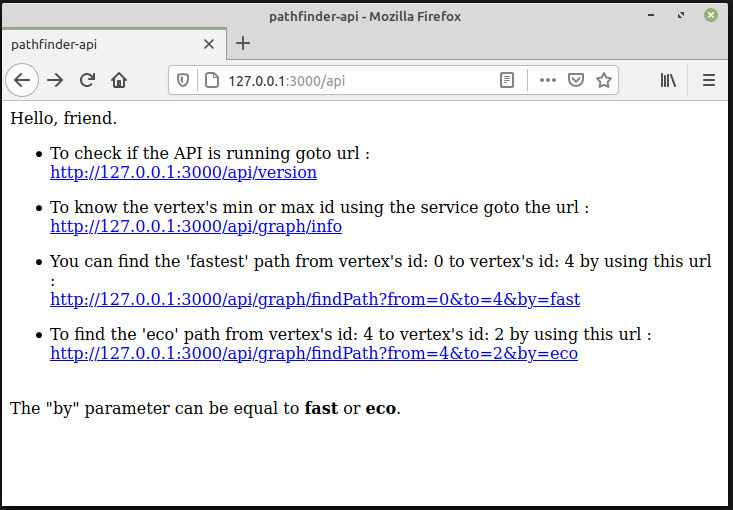
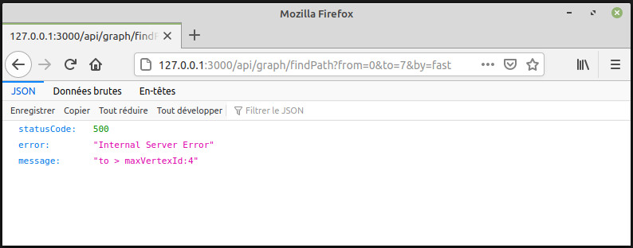
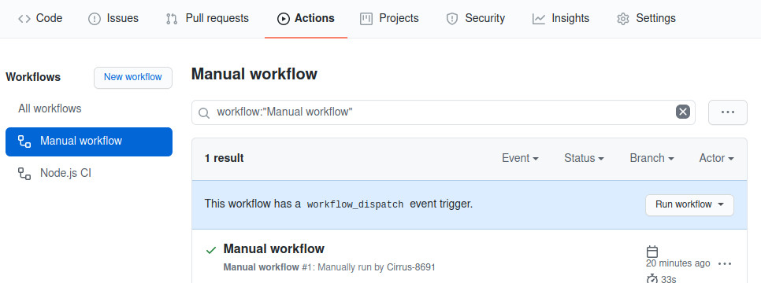
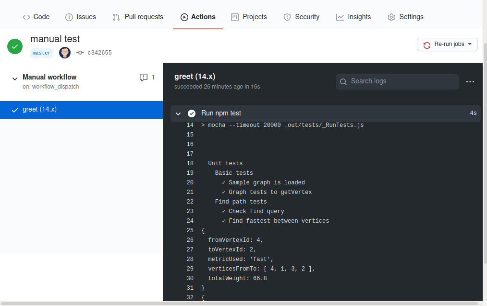

# Node.js with TypeScript path finder
<p>
  <a href="./LICENSE">
      
  </a>
  
</p>
Author : Frédéric Diaz<br>
This is a micro service used to find the fastest or eco path between two vertices in a graph.

## Getting started
 - Donwload the source, then to install dependencies, type :
```bash
npm install
```
- To run the project use :
```bash
npm start
```
- Open <a href="http://127.0.0.1:3000/api">`http://127.0.0.1:3000/api`</a> url in your browser.
- You should see `Hello, friend` with a set of sample url to run the service.
<p align="center">
    
</p>

- As a sample you can find the fastest path from vertex id: 1 to vertex id: 4 by typing<br> 
<a href="http://127.0.0.1:3000/api/graph/findPath?from=1&to=4&by=fast">`http://127.0.0.1:3000/api/graph/findPath?from=1&to=4&by=fast`</a>

 - Be careful the service checks the border of the vertex's id and can throw exceptions.<br>
 Sample :
<p align="center">
    
</p>


## Other tests
- To run the unit tests, type :
```bash
npm test
```

##  Continuous integration
The Github repository has two workflows in "Actions" defined in the 
<a href="./.github/workflows">Yaml files in ./github/workflows/</a><br/>
The <a href="./.github/workflows/manual.yml">Manual workflow</a> can be used to run (click on "Run Workflow" button) the unit tests in the Github pipeline. NB : Refresh the HTML page if nothing moves.
<br/>
The other workflow <a href="./.github/workflows/node.js.yml">Node.js CI</a> is used for continuous integration.
<p align="center">
    
</p>
You can see the result of the Unit tests in the web console.
<br/>
<br/>
<p align="center">
    
</p>